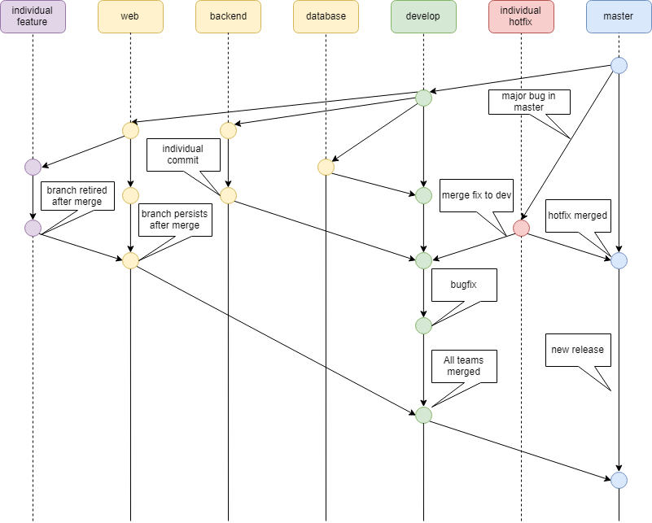

# BestSuperTeam

## Java Version
Please ensure you have [JDK 8](http://www.oracle.com/technetwork/java/javase/downloads/jdk8-downloads-2133151.html) installed

## IDE
I suggest using [IntelliJ](https://www.jetbrains.com/idea/) for your IDE and will write the instructions for getting setup using IntelliJ. 
It has built in support for building Spring and Maven applications. 
It also has support for viewing/editing databases integrated (so no need to use SQLDeveloper)
And its free for students! 

## Cloning this repo
I am going to go over the process of cloning the project through IntelliJ as it is the simplest way.
Alternatively you can still clone via command line and import with your preffered IDE.

1. Navigate to File > New > Project from Version Control > Github
2. Paste this repo's repoistory URL in the the top field (https://github.com/FilipHasson/BestSuperTeam.git)
3. Change your path/directory name if you wish and hit clone
4. When the project is downloaded you will have to do some basic setup with Intellij
5. In the bottom right corner corner click the speach bubble to open the Event Log
6. There should be a message reading `Non-managed pom.xml file found:`
7. Click the link below reading `Add as Maven Project` and wait for the process to complete
8. There should be another event reading `Frameworks detected: Web framework is detected in the project`
9. Click the `Configure` link
10. This should bring up a popup, if it has a list of selected files click OK without changing any
10.1 If it reads `No frameworks are detected` simply click OK 
11. Clear your event log
12. Attempt the next section Building The Project, this should give you a new event reading `Error running Build: Project JDK is not specified.`
13. Click the `Configure` link
14. Select Java Verson 1.8 you may have to click New > JDK and navigate to your 
15. Ensure that Project Language Level is set to `8 - Lambdas, type annotations ect.`
16. Click Apply followed by OK and attempt to run the build again, this time it should succeed

## Buildng The Project
Now that the project is fully imported we will need to build it
1. Navigate to Run > Edit Configurations...
2. In the top left corner of the new window click the + sign
3. Select Maven from the dropdown list
4. Name the configuration 'Build'
5. Ensure the Working Directory is pointing to your project directory 
6. Enter `clean install` in the Command line field
7. Click 'Apply' then 'OK'
8. Navigate to Run > Run 'Build'
9. In the bottom of the screen you should see an output log. This may take several minutes the first time you run this as all the dependancies need to be resolved and downloaded. Once you see BUILD SUCCESS check that a .war file was generated in the new target directory of your project

## Tomcat Install
This section will go over installing your local Tomcat 7. 
This is an application server that will run off of your own machine and is used as a testing/development environment

1. Go to [Tomcat](https://tomcat.apache.org/download-70.cgi)
2. Click '7.0.82' under Quick Navigation
3. When the .zip file downloads extract create a directory named 'Tomcat' and extract the contents of the .zip there
4. Within your tomcat directory go to conf and edit tomcat-users.xml erase the contents of the file and replace it with:
```
<?xml version='1.0' encoding='utf-8'?>
<tomcat-users>
	<role rolename="manager-gui"/>
	<user username="admin" password="admin" roles="manager-gui"/>
</tomcat-users>
```
5. Save the file, you can change the username and password if you wish, but this is a local server so it won't matter security wise


## Deploying To Tomcat
Now that you have your project built as a .war and your Tomcat installed this section will show how to deploy/run the project
1. Ensure that your Tomcat is not running (If this is your first time doing this disregard this step)
2. Copy your .war file: `~/target/best-superteam.war`
3. Paste your .war file in: `~/Tomcat/webapps`
4. In a terminal cd to the Tomcat directory
5. Run the command `./bin/startup.sh`
6. Verify the server stared up with the command `tail logs/catalina.out`
7. The last line of output should look similar to: `INFO: Server startup in 4852 ms`
8. This means your server has started, if it does not give this message try the command again in a few seconds.
   Depending on the size of the application and speed of your computer startup time will vary
9. In a web browser go to (http://localhost:8080) to verify that the server has started (should have a GUI)
10. To run our application go to (http://localhost:8080/best-superteam/)
11. Alternatively you can go to the Manager App and log in with the credentials you defined above and enter the application through there
12. To shut down your Tomcat server from the Tomcat directory run the command `./bin/shutdown.sh`

Note: If you redeploy a new WAR and notice no changes, shutdown the server, delete the `best-superteam` directory from within `~/Tomcat/webapps` and start the server again

## Project Settings
Going to document fixes to miscellanious project settings problems that occur.
### Project Language Level
1. Navigate to File > Project Structure > Project Settings/Modules
2. Change `Language Level` to `8 Lambdas, Type Annotations ect.`
### Project Target Source
1. Navigate to File > Settings > Build, Execution, Deployment > Java Compiler
2. Change `Target Bytecode Version` to 1.8

## Accessing the Database
With the most recent commit to the Database branch I've created a locale Sqlite3 Database for our use.
To view/access the database through IntelliJ:
1. Open the Database View (ctrl+shift+a search for database)
2. Click the green plus sign in the top left corner of the new window
3. Select Data Source > Sqlite(Xerial)
4. Under file hit ... and navigate to ~/BestSuperTeam/database/bestsuperteam.db
5. Click the button underneath to download the approrpaite driver
6. Click Apply then OK
You should now be able to view all the databases/schemas/tables and edit them in IntelliJ

## Running The Program With DB Use
In order to run the program and successfuly use the database there are a few quick changes that need to be made.
First is setting the JDBC Path
1. Open the file `src>main>java>com>best>superteam>config>Constants.java`
2. Edit DB_PATH by replacing the '~'symbol with the path to your directory for example mine looks like:
	`"C:/Users/filip/IdeaProjects/BestSuperTeam/database/bestsuperteam.db"`
Second is importing the library for sqlite in IntelliJ
1. Navigate to File > Project Structure
2. On the side panel select Libraries
3. Click the plus sign on the top of the page to and select Java
4. In the file selector go to `~/BestSuperTeam/database/sqlite-jdbc-3.21.0.jar`
5. Click Apply and OK
The code should now be able to run and not get an SQLException when reaching JDBC portions

## Using Git
Because of the number of people developing for this project we should follow a proper project management system
`master` should always contain our last delivered demo code, thus it will always be working
`develop` is where we will merge our each teams changes. We should only be merging functioning code into develop, and this branch will work as a staging ground to ensure everything is working be 
The remaining 3 branchs i've create `database`, `backend`, and `web` can be used at the discretion of each team. You can create branches off of these for individual developers, individual features or simply push directly to that branch.
Before attempting to merge into `develop` or `master` you should submit a Pull Requeest so that someone else can review the changes before attempting the merge. This will minimize the potential for any conflicts, catch issues or bugs, and reduce the ammount of commits to the main two branches low which will help with tracking whats actually been done.



